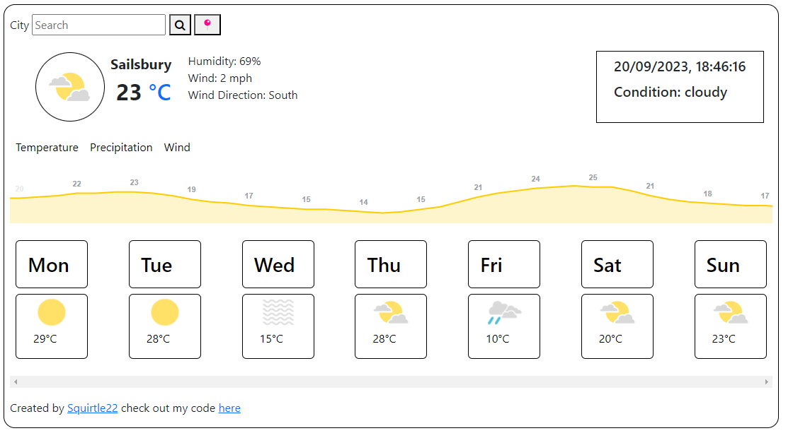
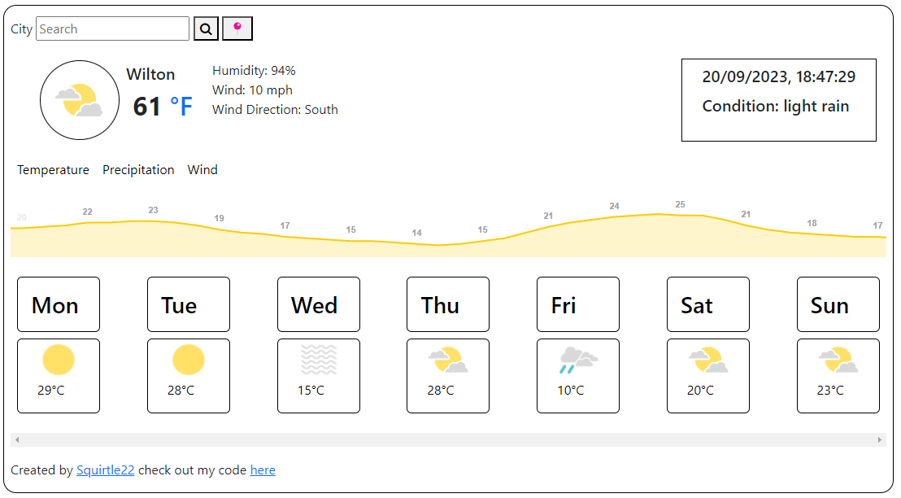
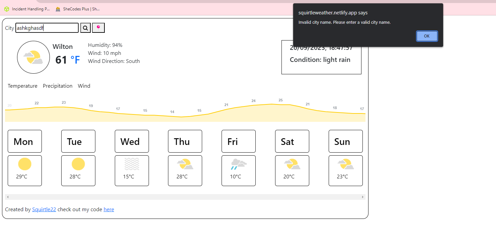

# Squirtle Weather App



Welcome to the Squirtle Weather App! This web application allows you to check the current weather conditions for a specific city or your current location. You can also view the weather forecast for the next 7 days. The app provides information such as temperature, humidity, wind speed, and more.

## Features

- **Search by City:** Enter the name of a city in the input field and click the search button to get the current weather conditions for that city.

- **Current Location:** Click the "Current Location" button to fetch the weather data for your current location using geolocation.

- **Temperature Unit:** You can toggle between Celsius and Fahrenheit units by clicking on the temperature value.

- **7-Day Weather Forecast:** Scroll horizontally to view the weather forecast for the next 7 days, including the day of the week, an icon representing the weather condition, and the temperature.

## Live Demo

You can try the app live by following this [link](https://squirtleweather.netlify.app/).

## Screenshots

### Locational based weather


### Error catching if searching fails



## Technologies Used

- HTML
- CSS
- JavaScript
- [Bootstrap](https://getbootstrap.com/) (for styling)
- [Font Awesome](https://fontawesome.com/) (for icons)
- [OpenWeatherMap API](https://openweathermap.org/api) (for weather data)

## Usage

1. Enter a city name in the input field and click the search button to get the weather for that city.

2. Click the "Current Location" button to fetch the weather data for your current location.

3. Toggle between Celsius and Fahrenheit units by clicking on the temperature value.

4. Scroll horizontally to view the 7-day weather forecast.

## Development

If you'd like to run this project locally or contribute to it, you can clone the GitHub repository:

```bash
git clone https://github.com/Squirtle22/Squirtle-weather.git
```

Make sure to replace `'YOUR_API_KEY'` in the `index.js` file with your [OpenWeatherMap API key](https://openweathermap.org/api).

## Author

This Weather App was created by [Squirtle22](http://github.com/Squirtle22).


## License

This project is open-source and available under the [MIT License](LICENSE).

## Acknowledgments

- Weather data provided by [OpenWeatherMap](https://openweathermap.org/).
- Icons by [Font Awesome](https://fontawesome.com/).

Enjoy checking the weather with Squirtle Weather App!
